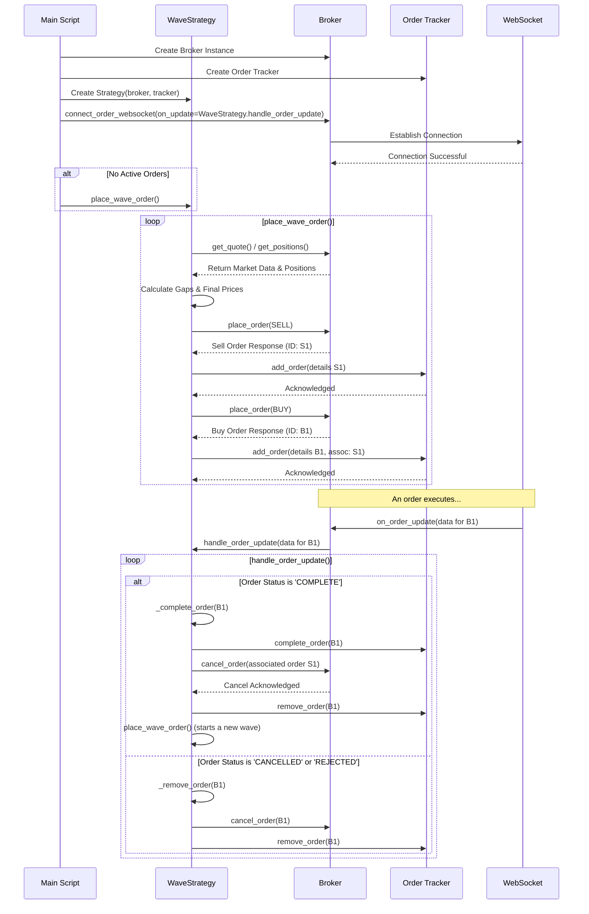

### Explanation of the Wave Extractor Feature Diagram

This diagram illustrates the sequence of operations in the Wave Extractor trading strategy. It is divided into three main sections: **Initialization**, **Placing a Wave Order**, and **Handling Order Updates**.

#### 1. Initialization

1.  **Create Instances**: The `Main Script` begins by creating instances of the `BrokerGateway`, `OrderTracker`, and `WaveStrategy`. The `WaveStrategy` is initialized with the broker and order tracker instances, giving it the necessary tools to interact with the market and manage orders.
2.  **Connect WebSocket**: The `Main Script` then calls `connect_order_websocket` on the `BrokerGateway`, passing `WaveStrategy.handle_order_update` as the callback function. This establishes a WebSocket connection for receiving real-time order updates. When an update is received, the `handle_order_update` method is automatically invoked.
3.  **Initial Order**: If there are no active orders, the `Main Script` calls `place_wave_order()` to place the first set of buy and sell orders.

#### 2. Placing a Wave Order (`place_wave_order`)

The `place_wave_order` loop is the core of the strategy, responsible for placing buy and sell orders around the current market price.

1.  **Fetch Market Data**: The `WaveStrategy` calls `get_quote()` and `get_positions()` on the `BrokerGateway` to get the latest market data and current positions. This information is crucial for calculating the prices of the next wave.
2.  **Calculate Prices**: The strategy calculates the buy and sell gaps and determines the final prices for the orders.
3.  **Place Sell Order**: A `SELL` order is placed via the `BrokerGateway`. The response contains the `order_id`, which is used to track the order.
4.  **Track Sell Order**: The `WaveStrategy` calls `add_order` on the `OrderTracker` to add the sell order to the list of active orders.
5.  **Place Buy Order**: A `BUY` order is placed, and its `order_id` is also tracked. The buy order is associated with the sell order, creating a "wave."
6.  **Track Buy Order**: The buy order is also added to the `OrderTracker`.

#### 3. Handling Order Updates (`handle_order_update`)

When an order's status changes (e.g., it is executed, canceled, or rejected), the WebSocket pushes an update to the `BrokerGateway`, which then calls the `handle_order_update` method in `WaveStrategy`.

1.  **Order Complete**: If the order status is `COMPLETE`, the `_complete_order` method is called.
    *   The corresponding order is marked as complete in the `OrderTracker`.
    *   The associated order is canceled via the `BrokerGateway`.
    *   The completed order is removed from the `OrderTracker`.
    *   A new wave is started by calling `place_wave_order()`.
2.  **Order Canceled/Rejected**: If the order is `CANCELLED` or `REJECTED`, the `_remove_order` method is called.
    *   The order is canceled via the `BrokerGateway`.
    *   The order is removed from the `OrderTracker`.

This sequence ensures that the strategy continuously places new waves of orders as old ones are completed, canceled, or rejected, allowing it to adapt to changing market conditions.
